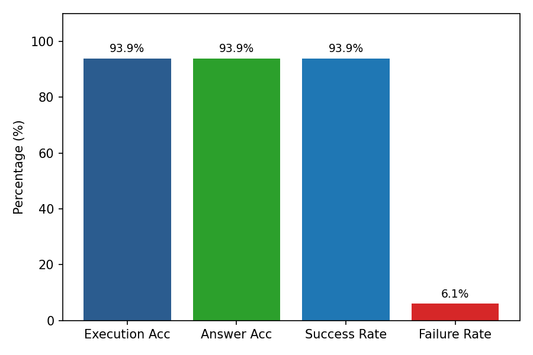
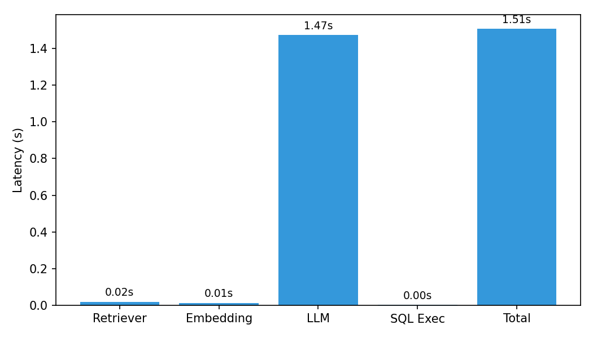

# QueryMind — Natural Language to SQL Platform

Ask questions in plain English and get instant SQL results against your uploaded data.

## System Architecture & Workflow

```
                               ┌──────────────────────────┐
                               │       React + Vite       │
                               │   Frontend (Port 3000)   │
                               └────────────┬─────────────┘
                                            │ HTTP (JWT)
                                            ▼
                               ┌──────────────────────────┐
                               │     FastAPI Backend      │
                               │       (Port 8000)        │
                               └──────┬─────┬─────┬───────┘
                                      │     │     │
         ┌────────────────────────────┘     │     └──────────────────────────┐
         │ (Read/Write Cache)               │ (Schema & Query Events)        │ (DDL Vectors & RAG)
         ▼                                  ▼                                ▼
┌─────────────────┐               ┌──────────────────┐             ┌──────────────────┐
│   Redis 7.0     │               │   Apache Kafka   │             │   ChromaDB       │
│  (Port 6379)    │               │   (Port 9092)    │             │   (Port 8001)    │
└─────────────────┘               └─────────┬────────┘             └──────────────────┘
                                            │
                                            ▼
                               ┌──────────────────────────┐
                               │  Kafka Audit Consumer    │
                               │   (Async Background)     │
                               └────────────┬─────────────┘
                                            │ Write Audit Logs & Metadata
                                            ▼
                               ┌──────────────────────────┐
                               │      PostgreSQL 16       │
                               │  (Temp Schemas & Metadata│
                               └──────────────────────────┘
```

## Services

| Service | Port | Purpose |
|---------|------|---------|
| **Frontend** | 3000 | React 19 + Vite + Tailwind CSS 3 |
| **Backend** | 8000 | FastAPI (Python 3.12), NL→SQL pipeline |
| **PostgreSQL** | 5432 | Temp schemas `user_{uid}_{db_id}`, metadata, audit |
| **Redis** | 6379 | Query cache, refresh tokens, rate limiting |
| **Kafka** | 9092 | Event streaming (audit, auth, query, schema events) |
| **ChromaDB** | 8001 | Vector embeddings for schema + SQL example RAG |
| **Audit Consumer** | — | Kafka consumer persisting events asynchronously to Postgres |

## Quick Start

```bash
# 1. Clone and cd into the project
git clone https://github.com/dhruv-0512/QueryMind.git
cd QueryMind

# 2. Set your DeepSeek or Gemini API key in .env
DEEPSEEK_API_KEY=sk-your-key-here
LLM_PROVIDER=deepseek

# 3. Start everything with Docker Compose
docker compose up -d --build
```

Open **http://localhost:3000** — register an account and start querying.

## Upload Formats

Drag-and-drop upload of data files. Supported formats:

| Format | Extension |
|--------|-----------|
| CSV | `.csv` |
| Excel | `.xlsx`, `.xls` |
| JSON | `.json` |

On upload, the system:
1. Parses the file with **Pandas** (auto-detects column names & types, normalizes special characters & numeric column titles)
2. Creates a **temporary PostgreSQL schema** named `user_{user_id}_{db_id}`
3. Loads the data using **PostgreSQL COPY protocol** via asyncpg for maximum speed
4. Extracts the **DDL** and generates **vector embeddings** in ChromaDB (`BAAI/bge-small-en-v1.5` local fallback or Gemini)
5. Tables are indexed for RAG-assisted SQL generation with curated example retrieval

## Benchmark & Evaluation

QueryMind includes an automated evaluation harness built on an independent benchmark containing unseen natural-language paraphrases, multi-table joins, aggregations, and nested queries.

### Key Benchmark Metrics

| Metric Category | Metric Name | Score | Standard |
| :--- | :--- | :--- | :--- |
| **SQL Generation** | **Execution Accuracy** | **`93.88%`** | Realistic Unseen Evaluation |
| **SQL Generation** | **Semantic Answer Accuracy** | **`93.88%`** | Exact Canonical Result Match |
| **Retrieval** | **Top-1 Recall** | **`100.0%`** | Candidate Schema & Example Match |
| **Retrieval** | **Top-5 Recall** | **`100.0%`** | Top-5 Retrieval Coverage |
| **Retrieval** | **Mean Reciprocal Rank (MRR)** | **`1.0`** | Mean Reciprocal Rank Score |
| **Latency** | **Average End-to-End Latency** | **`1.51s`** | Full Pipeline (Embedding + LLM + SQL) |
| **Latency** | **P95 Latency** | **`1.87s`** | 95th Percentile Latency Profile |
| **SQL Safety** | **Read-Only SQL Validation** | **`100.0%`** | Prohibited DDL/DML Rejection |

The evaluation harness automatically executes the generated SQL against the benchmark database, compares the returned results with the reference outputs, measures retrieval quality and latency, validates SQL safety, and produces Markdown, JSON, and visualization reports for every run.

### Visual Evidence & Latency Charts

<p align="center">
  
  
</p>

### Automated Failure Detection & Classification

Rather than relying on superficial checks, the evaluation harness parses execution tracebacks and classifies failure modes to catch schema hallucinations and query misalignments:

```json
{
    "question": "Find which airports serve as both an origin and destination for more than 50 flights combined?",
    "generated_sql": "SELECT ap.airport_code FROM airports ap WHERE (SELECT COUNT(*) FROM flights WHERE invalid_column = origin_airport_id)...",
    "execution_success": false,
    "result_correctness": false,
    "execution_error": "no such column: invalid_column",
    "failure_category": "Column Hallucination"
}
```

To run the evaluation harness locally:

```bash
python evaluation/evaluate.py
```

All evaluation artifacts, charts, and detailed JSON outputs are stored in [`evaluation/results/`](file:///C:/Users/dhruv/Desktop/PROJECTS/New%20folder%20%287%29/evaluation/results).

## How It Works & Resiliency Patterns

1. **Upload** a CSV/XLSX/JSON file — data is bulk-loaded via PostgreSQL COPY protocol for speed.
2. **Ask** a question in natural language (e.g. "Show top 5 sales in 2024").
3. **RAG Retrieval** runs two searches in parallel against ChromaDB:
   - Retrieves the **table schema** (column names, types) for the target database
   - Retrieves the **top-5 most similar question→SQL pairs** from a curated pool of ~2,000 real-world examples.
4. **SQL Generation Pathways & The 78% Threshold**:
   - **RAG-Direct (Cosine Similarity ≥ 78%)**: When a user question matches an indexed SQL template with high confidence ($\ge 78\%$), direct Python template remapping is triggered. This executes in **<15ms with $0 API cost**, skipping LLM calls completely while eliminating model hallucination risks for common query patterns.
   - **LLM Adaptation (Cosine Similarity < 78%)**: When similarity is below 78%, structural template remapping is not safe. The schema and top retrieved examples are passed to **DeepSeek AI** (or Gemini) to reason about complex multi-clause query construction.
5. **Circuit Breaker Protection**: Wraps external LLM network calls. If 5 consecutive API errors occur, the circuit opens for 30s, failing fast in `<1ms` to keep backend threads responsive.
6. **SQL Safety & Execution**: Enforces read-only SELECT/WITH statements and runs against the user's isolated PostgreSQL temp schema.
7. **Caching & Idempotent Event Audit**: Caches query results in **Redis** (1 hour TTL) and streams asynchronous events across 4 topics to **Apache Kafka**. A background `audit_consumer` executes **idempotent database writes** (`ON CONFLICT (event_id) DO NOTHING`), preventing duplicate audit entries if consumer offsets are redelivered upon restart.

## Environment Variables

| Variable | Description |
|----------|-------------|
| `DEEPSEEK_API_KEY` | DeepSeek API key for high-speed SQL generation |
| `DEEPSEEK_MODEL` | DeepSeek model choice (e.g., `deepseek-chat`) |
| `GEMINI_API_KEY` | Google Gemini API key fallback |
| `LLM_PROVIDER` | Preferred LLM provider (`deepseek`, `gemini`, or `mock`) |
| `EMBEDDING_PROVIDER` | Embedding provider (`local`, `gemini`, or `auto`) |
| `JWT_SECRET_KEY` | Secret for JWT signing |
| `DATABASE_URL` | PostgreSQL connection string |
| `REDIS_URL` | Redis connection string |
| `KAFKA_BOOTSTRAP_SERVERS` | Kafka broker address |
| `CHROMADB_HOST` / `CHROMADB_PORT` | ChromaDB vector database connection |

## Tech Stack

**Frontend:** React 19, JavaScript (ES2023), Vite, Tailwind CSS 3, Recharts, Lucide Icons  
**Backend:** FastAPI, SQLAlchemy 2.0 (async), asyncpg (COPY), Pandas, Alembic, Circuit Breaker  
**Infra:** PostgreSQL 16, Redis 7, Kafka 7.6, ChromaDB, Docker Compose  
**AI / ML:** DeepSeek AI, Google Gemini, BGE-small-en (local fastembed)
